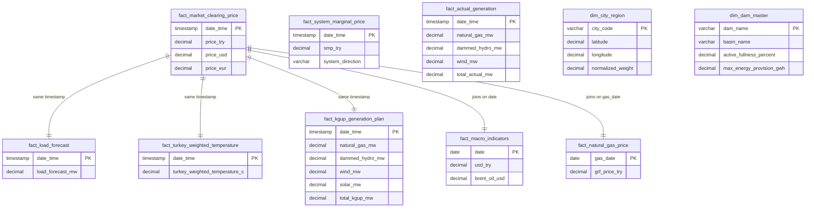

# Data Dictionary & Database Architecture Specification

## 1. Project Overview & Objective

The primary objective of this system is **Electricity Market Clearing Price (PTF - Piyasa Takas Fiyatı) Forecasting** for the Turkish Electricity Market (EPİAŞ GÖP).

To achieve high-accuracy price predictions, the data pipeline aggregates:

1. **EPİAŞ Day-Ahead & Real-Time Electricity Market Features** (Hourly)
2. **Natural Gas Reference Prices (SGP)** (Daily)
3. **Macro Financial Indicators** (USD/TRY, Brent Oil) (Daily)
4. **Meteorological Indicators** (Consumption-Weighted Turkey Hourly Temperature across 26 Regions) (Hourly)
5. **Hydro & Reservoir Physical Parameters** (Static Dam Master Data)

---

## 2. Dataset Catalogue & Attribute Specifications

### A. Time-Series Datasets (Hourly & Daily Features)

#### 1. Market Clearing Price (`03_mcp` / `fact_market_clearing_price`)

- **Source**: EPİAŞ Transparency API (`/electricity-service/v1/markets/mcp/data/mcp`)
- **Frequency**: Hourly ($24$ observations/day)
- **Granularity**: Hourly Timestamp
- **Description**: Market Clearing Price (PTF) determined in the Day-Ahead Market. Primary **target variable ($y$)** for machine learning models.

| Attribute Name | Data Type      | Constraint   | Description                                      | Example                  |
| -------------- | -------------- | ------------ | ------------------------------------------------ | ------------------------ |
| `date_time`    | TIMESTAMP (TZ) | PK, NOT NULL | Hourly Timestamp (Europe/Istanbul)               | `2024-01-01 00:00:00+03` |
| `price_try`    | DECIMAL(10,2)  | NOT NULL     | Market Clearing Price in Turkish Lira (TRY/MWh)  | `2250.00`                |
| `price_usd`    | DECIMAL(10,2)  | NULLABLE     | Market Clearing Price converted in USD (USD/MWh) | `75.42`                  |
| `price_eur`    | DECIMAL(10,2)  | NULLABLE     | Market Clearing Price converted in EUR (EUR/MWh) | `68.90`                  |

---

#### 2. System Marginal Price (`04_smp` / `fact_system_marginal_price`)

- **Source**: EPİAŞ Transparency API (`/electricity-service/v1/markets/smp/data/smp`)
- **Frequency**: Hourly ($24$ observations/day)
- **Description**: Real-time balancing market price (SMF - Sistem Marjinal Fiyatı) and grid direction indicator.

| Attribute Name             | Data Type      | Constraint   | Description                                                    | Example                  |
| -------------------------- | -------------- | ------------ | -------------------------------------------------------------- | ------------------------ |
| `date_time`                | TIMESTAMP (TZ) | PK, NOT NULL | Hourly Timestamp                                               | `2024-01-01 00:00:00+03` |
| `smp_try`                  | DECIMAL(10,2)  | NOT NULL     | System Marginal Price (TRY/MWh)                                | `2400.50`                |
| `system_direction`         | VARCHAR(20)    | NOT NULL     | Grid status (`ENERGY_DEFICIT`, `ENERGY_SURPLUS`, `IN_BALANCE`) | `ENERGY_DEFICIT`         |
| `positive_imbalance_price` | DECIMAL(10,2)  | NULLABLE     | Pozitif Dengesizlik Fiyatı (TRY/MWh)                           | `2137.50`                |
| `negative_imbalance_price` | DECIMAL(10,2)  | NULLABLE     | Negatif Dengesizlik Fiyatı (TRY/MWh)                           | `2520.53`                |

---

#### 3. Load Forecast (`01_load_forecast` / `fact_load_forecast`)

- **Source**: EPİAŞ Transparency API (`/electricity-service/v1/consumption/data/load-plan`)
- **Frequency**: Hourly
- **Description**: Official day-ahead electricity demand/consumption forecast for Turkey (MW).

| Attribute Name     | Data Type      | Constraint   | Description                  | Example                  |
| ------------------ | -------------- | ------------ | ---------------------------- | ------------------------ |
| `date_time`        | TIMESTAMP (TZ) | PK, NOT NULL | Hourly Timestamp             | `2024-01-01 00:00:00+03` |
| `load_forecast_mw` | DECIMAL(10,2)  | NOT NULL     | Day-Ahead Load Forecast (MW) | `34520.80`               |

---

#### 4. Final Production Program (`02_kgup` / `fact_kgup_generation_plan`)

- **Source**: EPİAŞ Transparency API (`/electricity-service/v1/generation/data/kgup`)
- **Frequency**: Hourly
- **Description**: Day-ahead scheduled generation commitment (KGÜP) breakdown by fuel source.

| Attribute Name     | Data Type      | Constraint   | Description                             | Example                  |
| ------------------ | -------------- | ------------ | --------------------------------------- | ------------------------ |
| `date_time`        | TIMESTAMP (TZ) | PK, NOT NULL | Hourly Timestamp                        | `2024-01-01 00:00:00+03` |
| `natural_gas_mw`   | DECIMAL(10,2)  | NOT NULL     | Scheduled Natural Gas Generation (MW)   | `8420.00`                |
| `dammed_hydro_mw`  | DECIMAL(10,2)  | NOT NULL     | Scheduled Dammed Hydro Generation (MW)  | `6150.50`                |
| `run_of_river_mw`  | DECIMAL(10,2)  | NOT NULL     | Scheduled Akarsu Hydro Generation (MW)  | `1850.20`                |
| `lignite_mw`       | DECIMAL(10,2)  | NOT NULL     | Scheduled Lignite Coal Generation (MW)  | `4200.00`                |
| `imported_coal_mw` | DECIMAL(10,2)  | NOT NULL     | Scheduled Imported Coal Generation (MW) | `5100.00`                |
| `wind_mw`          | DECIMAL(10,2)  | NOT NULL     | Scheduled Wind Generation (MW)          | `3200.40`                |
| `solar_mw`         | DECIMAL(10,2)  | NOT NULL     | Scheduled Solar Generation (MW)         | `1400.00`                |
| `geothermal_mw`    | DECIMAL(10,2)  | NOT NULL     | Scheduled Geothermal Generation (MW)    | `850.00`                 |
| `other_mw`         | DECIMAL(10,2)  | NULLABLE     | Biogas, Fuel Oil, Waste Generation (MW) | `650.00`                 |
| `total_kgup_mw`    | DECIMAL(10,2)  | NOT NULL     | Total Scheduled Generation (MW)         | `31841.10`               |

---

#### 5. Actual Real-Time Generation (`07_actual_generation` / `fact_actual_generation`)

- **Source**: EPİAŞ Transparency API (`/electricity-service/v1/generation/data/rt-gen`)
- **Frequency**: Hourly
- **Description**: Realized actual power generation breakdown across all fuel types.

| Attribute Name     | Data Type      | Constraint   | Description                            | Example                  |
| ------------------ | -------------- | ------------ | -------------------------------------- | ------------------------ |
| `date_time`        | TIMESTAMP (TZ) | PK, NOT NULL | Hourly Timestamp                       | `2024-01-01 00:00:00+03` |
| `natural_gas_mw`   | DECIMAL(10,2)  | NOT NULL     | Realized Natural Gas Generation (MW)   | `8310.40`                |
| `dammed_hydro_mw`  | DECIMAL(10,2)  | NOT NULL     | Realized Dammed Hydro Generation (MW)  | `5980.10`                |
| `run_of_river_mw`  | DECIMAL(10,2)  | NOT NULL     | Realized Run-of-River Generation (MW)  | `1820.00`                |
| `lignite_mw`       | DECIMAL(10,2)  | NOT NULL     | Realized Lignite Coal Generation (MW)  | `4150.00`                |
| `imported_coal_mw` | DECIMAL(10,2)  | NOT NULL     | Realized Imported Coal Generation (MW) | `5050.00`                |
| `wind_mw`          | DECIMAL(10,2)  | NOT NULL     | Realized Wind Generation (MW)          | `3410.20`                |
| `solar_mw`         | DECIMAL(10,2)  | NOT NULL     | Realized Solar Generation (MW)         | `1350.00`                |
| `geothermal_mw`    | DECIMAL(10,2)  | NOT NULL     | Realized Geothermal Generation (MW)    | `840.00`                 |
| `total_actual_mw`  | DECIMAL(10,2)  | NOT NULL     | Total Realized Generation (MW)         | `31910.70`               |

---

#### 6. Actual Real-Time Consumption (`08_actual_consumption` / `fact_actual_consumption`)

- **Source**: EPİAŞ Transparency API (`/electricity-service/v1/consumption/data/rt-cons`)
- **Frequency**: Hourly
- **Description**: Realized grid electricity consumption (MW).

| Attribute Name   | Data Type      | Constraint   | Description                           | Example                  |
| ---------------- | -------------- | ------------ | ------------------------------------- | ------------------------ |
| `date_time`      | TIMESTAMP (TZ) | PK, NOT NULL | Hourly Timestamp                      | `2024-01-01 00:00:00+03` |
| `consumption_mw` | DECIMAL(10,2)  | NOT NULL     | Realized Electricity Consumption (MW) | `34120.50`               |

---

#### 7. Day-Ahead Bids & Offers (`05_purchase_bids` & `06_sale_offers` / `fact_dam_bids_offers`)

- **Source**: EPİAŞ Transparency API (`/electricity-service/v1/markets/mcp/data/dam-bid`, `dam-offer`)
- **Frequency**: Hourly
- **Description**: Aggregated Day-Ahead Market purchase demand volume and supply offer volume (MWh).

| Attribute Name            | Data Type      | Constraint   | Description                     | Example                  |
| ------------------------- | -------------- | ------------ | ------------------------------- | ------------------------ |
| `date_time`               | TIMESTAMP (TZ) | PK, NOT NULL | Hourly Timestamp                | `2024-01-01 00:00:00+03` |
| `purchase_bid_volume_mwh` | DECIMAL(12,2)  | NOT NULL     | Total Purchase Bid Volume (MWh) | `24510.40`               |
| `sale_offer_volume_mwh`   | DECIMAL(12,2)  | NOT NULL     | Total Sale Offer Volume (MWh)   | `28950.00`               |
| `matched_volume_mwh`      | DECIMAL(12,2)  | NULLABLE     | Cleared/Matched Volume (MWh)    | `23100.20`               |

---

#### 8. Natural Gas Reference Price (`12_natural_gas_daily_ref_price` / `fact_natural_gas_price`)

- **Source**: EPİAŞ Spot Natural Gas Market (SGP) (`/natural-gas-service/v1/markets/sgp/data/daily-reference-price`)
- **Frequency**: Daily
- **Description**: Gas Reference Price (GRF - Günlük Referans Fiyatı). Essential for natural gas power plant marginal cost modeling.

| Attribute Name     | Data Type     | Constraint   | Description                                    | Example      |
| ------------------ | ------------- | ------------ | ---------------------------------------------- | ------------ |
| `gas_date`         | DATE          | PK, NOT NULL | Gas Trading Day                                | `2024-01-01` |
| `grf_price_try`    | DECIMAL(10,2) | NOT NULL     | Gas Reference Price (TRY / $1000\text{ Sm}^3$) | `12500.00`   |
| `trade_volume_sm3` | DECIMAL(14,2) | NULLABLE     | Total Traded Volume ($\text{Sm}^3$)            | `1540200.00` |

---

#### 9. Financial Macro Indicators (`09_macro_indicators` / `fact_macro_indicators`)

- **Source**: `yfinance` (`USDTRY=X`, `BZ=F`)
- **Frequency**: Daily
- **Description**: Exchange rate and Brent crude oil benchmark prices influencing energy production marginal costs.

| Attribute Name  | Data Type    | Constraint   | Description                          | Example      |
| --------------- | ------------ | ------------ | ------------------------------------ | ------------ |
| `date`          | DATE         | PK, NOT NULL | Business Day Date                    | `2024-01-01` |
| `usd_try`       | DECIMAL(8,4) | NOT NULL     | USD / TRY Exchange Rate              | `29.7420`    |
| `brent_oil_usd` | DECIMAL(8,2) | NOT NULL     | Brent Crude Oil Price (USD / Barrel) | `77.84`      |

---

#### 10. Turkey Weighted Temperature (`13_turkey_weighted_temperature` / `fact_turkey_weighted_temperature`)

- **Source**: Open-Meteo Historical Archive API (Weighted across 26 electricity distribution regions)
- **Frequency**: Hourly
- **Description**: Consumption-weighted average temperature ($^\circ\text{C}$) for Turkey. Strongest driver of seasonal cooling/heating load spikes.

| Attribute Name                  | Data Type      | Constraint   | Description                                         | Example                  |
| ------------------------------- | -------------- | ------------ | --------------------------------------------------- | ------------------------ |
| `date_time`                     | TIMESTAMP (TZ) | PK, NOT NULL | Hourly Timestamp                                    | `2024-01-01 00:00:00+03` |
| `turkey_weighted_temperature_c` | DECIMAL(5,2)   | NOT NULL     | Consumption-Weighted Temperature ($^\circ\text{C}$) | `7.24`                   |

---

### B. Master & Static Reference Tables

#### 11. Distribution Region & City Config (`config_city_weights` / `dim_city_region`)

- **Source**: `config/city_percentages.json` & `config/city_coordinates.json`
- **Type**: Dimension Table (Static)
- **Description**: 26 Electricity Distribution Regions with geographic coordinates and normalized consumption weights.

| Attribute Name      | Data Type    | Constraint   | Description                                 | Example    |
| ------------------- | ------------ | ------------ | ------------------------------------------- | ---------- |
| `city_code`         | VARCHAR(20)  | PK, NOT NULL | City Name / Identifier                      | `İSTANBUL` |
| `latitude`          | DECIMAL(8,5) | NOT NULL     | Latitude                                    | `41.00820` |
| `longitude`         | DECIMAL(8,5) | NOT NULL     | Longitude                                   | `28.97840` |
| `raw_percentage`    | DECIMAL(5,2) | NOT NULL     | Raw Consumption Share Percentage (%)        | `15.46`    |
| `normalized_weight` | DECIMAL(8,6) | NOT NULL     | Normalized Weight ($w_i$, $\sum w_i = 1.0$) | `0.193153` |

---

#### 12. Master Hydro Dam Snapshots (`master_active_fullness` & `master_water_energy_provision`)

- **Source**: EPİAŞ Transparency API (`/electricity-service/v1/dams/...`)
- **Type**: Dimension / Latest Snapshot Table
- **Description**: Physical hydro capacities, active volumes ($m^3$), fullness percentages, and maximum GWh energy provision.

| Attribute Name             | Data Type      | Constraint   | Description                        | Example                  |
| -------------------------- | -------------- | ------------ | ---------------------------------- | ------------------------ |
| `dam_name`                 | VARCHAR(100)   | PK, NOT NULL | Dam / Hydro Plant Name             | `ATATÜRK BARAJI`         |
| `basin_name`               | VARCHAR(100)   | NOT NULL     | River Basin Name                   | `FIRAT HAVZASI`          |
| `active_fullness_percent`  | DECIMAL(5,2)   | NULLABLE     | Current Active Volume Fullness (%) | `64.20`                  |
| `max_energy_provision_gwh` | DECIMAL(10,2)  | NULLABLE     | Maximum Energy Potential (GWh)     | `1420.50`                |
| `last_updated_at`          | TIMESTAMP (TZ) | NOT NULL     | EPİAŞ Last Update Timestamp        | `2026-07-01 00:00:00+03` |

---

## 3. Recommended Relational Database Schema Design (PostgreSQL / TimescaleDB)



---

## 4. Analytical Feature Matrix (Unified ML View)

For machine learning model training (e.g. LightGBM, XGBoost, CatBoost, LSTM), create a unified hourly view `view_ml_feature_matrix`:

```sql
CREATE VIEW view_ml_feature_matrix AS
SELECT
    mcp.date_time,
    -- Target Variable
    mcp.price_try AS target_ptf_try,
    -- Electricity Demand & Forecast Features
    lf.load_forecast_mw,
    ac.consumption_mw AS actual_consumption_lag24,
    -- Generation Program Features
    kgup.natural_gas_mw AS kgup_gas_mw,
    kgup.dammed_hydro_mw AS kgup_hydro_mw,
    kgup.wind_mw AS kgup_wind_mw,
    kgup.solar_mw AS kgup_solar_mw,
    -- Realized Generation Lags
    gen.natural_gas_mw AS actual_gas_mw_lag24,
    gen.wind_mw AS actual_wind_mw_lag24,
    -- Bids & Offers Features
    bo.purchase_bid_volume_mwh,
    bo.sale_offer_volume_mwh,
    -- Weather Feature
    temp.turkey_weighted_temperature_c,
    -- Macro & Commodity Features (Joined on DATE)
    macro.usd_try,
    macro.brent_oil_usd,
    ng.grf_price_try AS natural_gas_ref_price_try,
    -- Calendar Features
    EXTRACT(HOUR FROM mcp.date_time) AS hour_of_day,
    EXTRACT(DOW FROM mcp.date_time) AS day_of_week,
    EXTRACT(MONTH FROM mcp.date_time) AS month_of_year,
    CASE WHEN EXTRACT(DOW FROM mcp.date_time) IN (0, 6) THEN 1 ELSE 0 END AS is_weekend
FROM fact_market_clearing_price mcp
LEFT JOIN fact_load_forecast lf ON mcp.date_time = lf.date_time
LEFT JOIN fact_actual_consumption ac ON mcp.date_time = ac.date_time
LEFT JOIN fact_kgup_generation_plan kgup ON mcp.date_time = kgup.date_time
LEFT JOIN fact_actual_generation gen ON mcp.date_time = gen.date_time
LEFT JOIN fact_dam_bids_offers bo ON mcp.date_time = bo.date_time
LEFT JOIN fact_turkey_weighted_temperature temp ON mcp.date_time = temp.date_time
LEFT JOIN fact_macro_indicators macro ON CAST(mcp.date_time AS DATE) = macro.date
LEFT JOIN fact_natural_gas_price ng ON CAST(mcp.date_time AS DATE) = ng.gas_date;
```

---

## 5. Storage & Indexing Best Practices

1. **TimescaleDB Hypertable**: Convert time-series tables (`fact_market_clearing_price`, `fact_load_forecast`, `fact_actual_generation`, `fact_turkey_weighted_temperature`) into TimescaleDB hypertables partitioned by `date_time` with 7-day or 1-month chunk intervals.
2. **Indexing Strategy**:
   - Compound index on `(date_time DESC)` for fast time-window slicing.
   - Foreign Key / Join Index on `CAST(date_time AS DATE)` for seamless joins with daily macro/gas tables.
3. **Imputation & Missing Value Policy**:
   - Financial macro data (weekends/holidays): Forward-filled (`ffill`).
   - Hourly temperature: Linear interpolation (`interpolate(method='linear')`) if Open-Meteo returns nulls.
