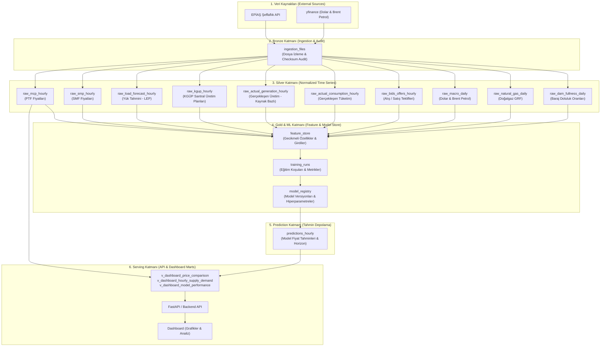
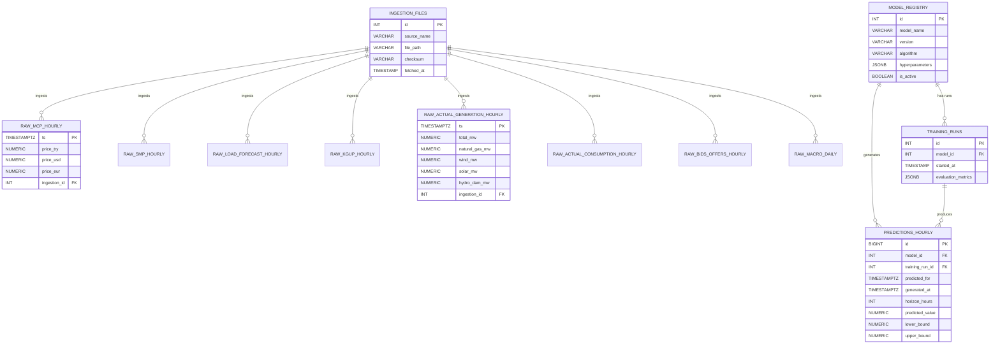

# ⚡ Enerji Fiyat Tahmini Projesi: PostgreSQL Veri Tabanı Mimarısı & Katmanlı Tasarım Rehberi

Bu doküman, **EPİAŞ ve Makro Finansal Verilerin** çekilmesinden başlayıp, **PostgreSQL** üzerinde depolanması, **Makine Öğrenmesi (ML) Modeli** eğitimi/tahmin üretimi, **Tahmin Depolama Katmanı** ve en nihayetinde **FastAPI / Dashboard** katmanına sunulmasını içeren uçtan uca veri mimarisini açıklar.

---

## 📐 1. Katmanlı Veri Tabanı Mimarisi (Medallion Architecture)

Sistemimiz **Medallion (Bronze - Silver - Gold - Predictions - Serving)** veri mimarisi prensiplerine uygun olarak 5 ana katmanda tasarlanmıştır.



---

## 🔄 2. Uçtan Uca Veri Akışı ve Yaşam Döngüsü

1. **ETL & Ingestion (Bronze → Silver):**
   - Python botu (`fetch_epias_data.py`) JSON dosyalarını indirir.
   - Her indirilen dosya `ingestion_files` tablosuna kaydedilir (MD5/SHA256 checksum ile çifte yükleme engellenir).
   - JSON verileri parse edilip ilgili `raw_*` saatlik/günlük Silver tablolarına `ON CONFLICT (ts) DO UPDATE` (Idempotent Insert) ile yazılır.

2. **Feature Engineering & Model Eğitimi (Silver → Gold):**
   - Makine öğrenmesi pipeline'ı Silver tablolarından geçmiş fiyatlar (PTF t-24, t-168), yenilenebilir üretim oranları, yük tahmini ve makro verileri birleştirerek `feature_store` oluşturur.
   - Eğitilen model `model_registry` ve `training_runs` tablolarına metrikleriyle (RMSE, MAE, MAPE) kaydolur.

3. **Tahmin Üretimi ve Kayıt (Model → Predictions):**
   - Aktif model, gelecek 24-48 saat için PTF/SMF tahmini üretir.
   - Tahminler `predictions_hourly` tablosuna `model_id`, `predicted_for` (hedef saat) ve `prediction_horizon_hours` ile basılır.

4. **API ve Dashboard Sunumu (Predictions & Silver → Serving):**
   - PostgreSQL üzerinde oluşturulan SQL Görünümleri (`VIEW`), Gerçekleşen PTF ile Tahmin Edilen PTF'yi yan yana getirir, hatayı hesaplar.
   - API tek bir SQL sorgusu ile dashboard grafikleri için gerekli veriyi milisaniyeler içinde sunar.

---

## 🔗 3. Varlık İlişki Diyagramı (ERD - Entity Relationship Diagram)



---

## 🗄️ 4. Detaylı Veri Tabanı Şeması ve Tablo Tanımları (PostgreSQL DDL)

### 🔴 BRONZE KATMANI (Audit & Ingestion Track)

#### `ingestion_files` Tablosu
İndirilen tüm JSON dosyalarının kaydını tutar, mükerrer veri işlenmesini önler.

```sql
CREATE TABLE IF NOT EXISTS ingestion_batches (
    id SERIAL PRIMARY KEY,
    source_name VARCHAR(100) NOT NULL,    -- Örn: 'mcp', 'actual_generation', 'macro'
    period_key VARCHAR(50) NOT NULL,      -- Örn: '2026-07' veya '2026-07-27'
    checksum VARCHAR(64) NOT NULL,        -- EPİAŞ API'sinden gelen bellekteki verinin SHA-256 dijital imzası
    row_count INT DEFAULT 0,              -- Çekilen ve işlenen toplam kayıt sayısı
    status VARCHAR(20) DEFAULT 'SUCCESS', -- 'SUCCESS', 'FAILED', 'SKIPPED'
    error_message TEXT NULL,
    fetched_at TIMESTAMPTZ DEFAULT NOW(),
    CONSTRAINT uq_source_checksum UNIQUE (source_name, checksum)
);
```


---

### ⚪ SILVER KATMANI (Normalized Time Series Tables)

Tüm zaman serisi verilerinde `ts` (`TIMESTAMPTZ` - Türkiye Saati `+03:00` ile uyumlu) Birincil Anahtar (Primary Key) olarak belirlenmiştir.

#### 1. `raw_mcp_hourly` (Piyasa Takas Fiyatı - PTF)
```sql
CREATE TABLE IF NOT EXISTS raw_mcp_hourly (
    ts TIMESTAMPTZ PRIMARY KEY,
    price_try NUMERIC(12, 4) NOT NULL, -- TL / MWh
    price_usd NUMERIC(12, 4),          -- USD / MWh
    price_eur NUMERIC(12, 4),          -- EUR / MWh
    ingestion_id INT REFERENCES ingestion_files(id) ON DELETE SET NULL,
    created_at TIMESTAMPTZ DEFAULT NOW()
);
```

#### 2. `raw_smp_hourly` (Sistem Marjinal Fiyatı - SMF)
```sql
CREATE TABLE IF NOT EXISTS raw_smp_hourly (
    ts TIMESTAMPTZ PRIMARY KEY,
    system_marginal_price_try NUMERIC(12, 4) NOT NULL,
    ingestion_id INT REFERENCES ingestion_files(id) ON DELETE SET NULL,
    created_at TIMESTAMPTZ DEFAULT NOW()
);
```

#### 3. `raw_load_forecast_hourly` (Yük Tahmini - LEP)
```sql
CREATE TABLE IF NOT EXISTS raw_load_forecast_hourly (
    ts TIMESTAMPTZ PRIMARY KEY,
    load_forecast_mw NUMERIC(12, 2) NOT NULL, -- LEP (MW)
    ingestion_id INT REFERENCES ingestion_files(id) ON DELETE SET NULL,
    created_at TIMESTAMPTZ DEFAULT NOW()
);
```

#### 4. `raw_kgup_hourly` (Kesinleşmiş Gün Öncesi Üretim Planı)
```sql
CREATE TABLE IF NOT EXISTS raw_kgup_hourly (
    ts TIMESTAMPTZ PRIMARY KEY,
    total_mw NUMERIC(12, 2) NOT NULL,
    natural_gas_mw NUMERIC(12, 2) DEFAULT 0,
    wind_mw NUMERIC(12, 2) DEFAULT 0,
    lignite_mw NUMERIC(12, 2) DEFAULT 0,
    black_coal_mw NUMERIC(12, 2) DEFAULT 0,
    import_coal_mw NUMERIC(12, 2) DEFAULT 0,
    fuel_oil_mw NUMERIC(12, 2) DEFAULT 0,
    geothermal_mw NUMERIC(12, 2) DEFAULT 0,
    dammed_hydro_mw NUMERIC(12, 2) DEFAULT 0,
    river_hydro_mw NUMERIC(12, 2) DEFAULT 0,
    naphtha_mw NUMERIC(12, 2) DEFAULT 0,
    biomass_mw NUMERIC(12, 2) DEFAULT 0,
    solar_mw NUMERIC(12, 2) DEFAULT 0,
    other_mw NUMERIC(12, 2) DEFAULT 0,
    ingestion_id INT REFERENCES ingestion_files(id) ON DELETE SET NULL,
    created_at TIMESTAMPTZ DEFAULT NOW()
);
```

#### 5. `raw_actual_generation_hourly` (Gerçekleşen Üretim - Kaynak Bazlı)
```sql
CREATE TABLE IF NOT EXISTS raw_actual_generation_hourly (
    ts TIMESTAMPTZ PRIMARY KEY,
    total_mw NUMERIC(12, 2) NOT NULL,
    natural_gas_mw NUMERIC(12, 2) DEFAULT 0,
    dammed_hydro_mw NUMERIC(12, 2) DEFAULT 0,
    lignite_mw NUMERIC(12, 2) DEFAULT 0,
    river_hydro_mw NUMERIC(12, 2) DEFAULT 0,
    import_coal_mw NUMERIC(12, 2) DEFAULT 0,
    wind_mw NUMERIC(12, 2) DEFAULT 0,
    solar_mw NUMERIC(12, 2) DEFAULT 0,
    fuel_oil_mw NUMERIC(12, 2) DEFAULT 0,
    geothermal_mw NUMERIC(12, 2) DEFAULT 0,
    asphaltite_coal_mw NUMERIC(12, 2) DEFAULT 0,
    black_coal_mw NUMERIC(12, 2) DEFAULT 0,
    biomass_mw NUMERIC(12, 2) DEFAULT 0,
    naphtha_mw NUMERIC(12, 2) DEFAULT 0,
    lng_mw NUMERIC(12, 2) DEFAULT 0,
    import_export_mw NUMERIC(12, 2) DEFAULT 0,
    waste_heat_mw NUMERIC(12, 2) DEFAULT 0,
    ingestion_id INT REFERENCES ingestion_files(id) ON DELETE SET NULL,
    created_at TIMESTAMPTZ DEFAULT NOW()
);
```

#### 6. `raw_actual_consumption_hourly` (Gerçekleşen Tüketim)
```sql
CREATE TABLE IF NOT EXISTS raw_actual_consumption_hourly (
    ts TIMESTAMPTZ PRIMARY KEY,
    consumption_mw NUMERIC(12, 2) NOT NULL,
    ingestion_id INT REFERENCES ingestion_files(id) ON DELETE SET NULL,
    created_at TIMESTAMPTZ DEFAULT NOW()
);
```

#### 7. `raw_bids_offers_hourly` (GÖP Eşleşen Alış ve Satış Miktarları)
```sql
CREATE TABLE IF NOT EXISTS raw_bids_offers_hourly (
    ts TIMESTAMPTZ PRIMARY KEY,
    bid_quantity_mw NUMERIC(12, 2),   -- Eşleşen Alış
    offer_quantity_mw NUMERIC(12, 2), -- Eşleşen Satış
    ingestion_id INT REFERENCES ingestion_files(id) ON DELETE SET NULL,
    created_at TIMESTAMPTZ DEFAULT NOW()
);
```

#### 8. `raw_macro_daily` (Finansal Makro Göstergeler - Günlük)
```sql
CREATE TABLE IF NOT EXISTS raw_macro_daily (
    entry_date DATE PRIMARY KEY,
    usd_try NUMERIC(10, 4) NOT NULL,
    brent_oil_usd NUMERIC(10, 4) NOT NULL,
    ingestion_id INT REFERENCES ingestion_files(id) ON DELETE SET NULL,
    created_at TIMESTAMPTZ DEFAULT NOW()
);
```

#### 9. `raw_natural_gas_daily` (Doğalgaz Günlük Referans Fiyatı - GRF)
```sql
CREATE TABLE IF NOT EXISTS raw_natural_gas_daily (
    entry_date DATE PRIMARY KEY,
    gas_reference_price_try NUMERIC(12, 4) NOT NULL,
    ingestion_id INT REFERENCES ingestion_files(id) ON DELETE SET NULL,
    created_at TIMESTAMPTZ DEFAULT NOW()
);
```

---

### 🟡 GOLD & ML KATMANI (Model Registry & Feature Store)

#### `model_registry` Tablosu
Geliştirilen ve canlıya alınan makine öğrenmesi modellerini tutar.

```sql
CREATE TABLE IF NOT EXISTS model_registry (
    id SERIAL PRIMARY KEY,
    model_name VARCHAR(100) NOT NULL,       -- Örn: 'LightGBM_PTF_Forecaster'
    version VARCHAR(50) NOT NULL,          -- Örn: 'v1.2.0'
    algorithm VARCHAR(50) NOT NULL,        -- Örn: 'LightGBM', 'XGBoost', 'Prophet'
    target_variable VARCHAR(50) NOT NULL,  -- Örn: 'PTF' veya 'SMF'
    hyperparameters JSONB DEFAULT '{}',    -- Learning rate, max_depth vb.
    feature_list JSONB DEFAULT '[]',       -- Kullandığı feature adları
    metrics JSONB DEFAULT '{}',            -- Test seti: {"RMSE": 45.2, "MAPE": 0.038}
    artifact_path TEXT NULL,              -- s3://... veya /models/lgb_v1.pkl
    is_active BOOLEAN DEFAULT FALSE,       -- Canlıda olan model mi?
    created_at TIMESTAMPTZ DEFAULT NOW(),
    CONSTRAINT uq_model_version UNIQUE (model_name, version)
);
```

#### `training_runs` Tablosu
Her bir model eğitim denemesinin detay kaydı.

```sql
CREATE TABLE IF NOT EXISTS training_runs (
    id SERIAL PRIMARY KEY,
    model_id INT NOT NULL REFERENCES model_registry(id) ON DELETE CASCADE,
    train_start_date DATE NOT NULL,
    train_end_date DATE NOT NULL,
    evaluation_metrics JSONB NOT NULL,     -- {"validation_mae": 32.1, "validation_rmse": 48.5}
    run_notes TEXT NULL,
    started_at TIMESTAMPTZ DEFAULT NOW(),
    completed_at TIMESTAMPTZ NULL
);
```

---

### 🟢 PREDICTION KATMANI (Tahmin Depolama)

#### `predictions_hourly` Tablosu
Model tarafından üretilen tüm tahminleri (gece çalışıp ertesi günün 24 saatini tahmin etme vb.) saklar.

```sql
CREATE TABLE IF NOT EXISTS predictions_hourly (
    id BIGSERIAL PRIMARY KEY,
    model_id INT NOT NULL REFERENCES model_registry(id) ON DELETE CASCADE,
    training_run_id INT NULL REFERENCES training_runs(id) ON DELETE SET NULL,
    predicted_for TIMESTAMPTZ NOT NULL,     -- Tahmin edilen zaman (Örn: 2026-07-28 14:00:00+03)
    generated_at TIMESTAMPTZ DEFAULT NOW(), -- Tahminin üretildiği zaman (Örn: 2026-07-27 10:00:00+03)
    horizon_hours INT NOT NULL DEFAULT 24,  -- Tahmin Ufku (Kaç saat sonrası?)
    target_variable VARCHAR(50) DEFAULT 'PTF',
    predicted_value NUMERIC(12, 4) NOT NULL, -- Tahmin Fiyatı (TL/MWh)
    lower_bound NUMERIC(12, 4) NULL,         -- Güven Aralığı Alt
    upper_bound NUMERIC(12, 4) NULL,         -- Güven Aralığı Üst
    features_snapshot JSONB NULL,           -- O an modele verilen girdiler (opsiyonel audit)
    created_at TIMESTAMPTZ DEFAULT NOW(),
    CONSTRAINT uq_pred_target UNIQUE (model_id, target_variable, predicted_for, generated_at)
);
```

---

## 📥 5. ETL Insert & Idempotency Stratejisi (`ON CONFLICT`)

Python ETL script'iniz veritabanına veri basarken **mükerrer kayıt hatası (Unique Constraint Violation)** almamak ve veriyi güncel tutmak için `ON CONFLICT (ts) DO UPDATE` kalıbı kullanılmalıdır.

### Örnek SQL Insert Cümleleri (Python / psycopg2 / SQLAlchemy ile Kullanım)

#### PTF (MCP) Insert Örneği:
```sql
INSERT INTO raw_mcp_hourly (ts, price_try, price_usd, price_eur, ingestion_id)
VALUES (
    '2026-07-27T00:00:00+03:00',
    2400.50,
    72.15,
    66.40,
    101
)
ON CONFLICT (ts) DO UPDATE SET
    price_try = EXCLUDED.price_try,
    price_usd = EXCLUDED.price_usd,
    price_eur = EXCLUDED.price_eur,
    ingestion_id = EXCLUDED.ingestion_id;
```

#### Tahmin Basma Insert Örneği:
```sql
INSERT INTO predictions_hourly (model_id, training_run_id, predicted_for, generated_at, horizon_hours, target_variable, predicted_value, lower_bound, upper_bound)
VALUES (
    1, -- Active LightGBM Model ID
    5, -- Training Run ID
    '2026-07-28 14:00:00+03',
    '2026-07-27 10:00:00+03',
    28,
    'PTF',
    2450.75,
    2380.00,
    2520.00
)
ON CONFLICT (model_id, target_variable, predicted_for, generated_at) DO UPDATE SET
    predicted_value = EXCLUDED.predicted_value,
    lower_bound = EXCLUDED.lower_bound,
    upper_bound = EXCLUDED.upper_bound;
```

---

## 📊 6. API ve Dashboard İçin Servis Katmanı Görünümleri (Database Views)

Dashboard (React, Next.js, Streamlit vb.) doğrudan karmaşık SQL JOIN cümleleri yazmak yerine, PostgreSQL üzerinde hazırlanmış optimize edilmiş `VIEW` yapısını sorgulayacaktır.

### 1. `v_dashboard_price_comparison` (Gerçekleşen PTF vs Tahmin Fiyatı & Hata Analizi)

Backend API (`/api/v1/dashboard/price-comparison`) bu görüntüyü sorgulayarak çizgi grafiği verisini milisaniyesinde çeker.

```sql
CREATE OR REPLACE VIEW v_dashboard_price_comparison AS
SELECT 
    p.predicted_for AS ts,
    m.version AS model_version,
    m.model_name,
    c.price_try AS actual_mcp,
    p.predicted_value AS predicted_mcp,
    p.lower_bound,
    p.upper_bound,
    (p.predicted_value - c.price_try) AS error_tl,
    ABS(p.predicted_value - c.price_try) AS abs_error_tl,
    CASE 
        WHEN c.price_try IS NOT NULL AND c.price_try > 0 
        THEN ROUND(ABS(p.predicted_value - c.price_try) / c.price_try * 100, 2)
        ELSE NULL 
    END AS percentage_error_mape,
    p.generated_at AS forecast_generated_at
FROM predictions_hourly p
JOIN model_registry m ON p.model_id = m.id
LEFT JOIN raw_mcp_hourly c ON p.predicted_for = c.ts
WHERE m.is_active = TRUE;
```

### 2. `v_dashboard_hourly_features` (Saatlik Arz, Talep ve Fiyat Analizi)

```sql
CREATE OR REPLACE VIEW v_dashboard_hourly_features AS
SELECT 
    m.ts,
    m.price_try AS mcp_ptf,
    s.system_marginal_price_try AS smp_smf,
    lf.load_forecast_mw AS lep_load_forecast,
    kg.total_mw AS kgup_total_mw,
    gen.total_mw AS actual_generation_mw,
    gen.natural_gas_mw AS gen_natural_gas_mw,
    gen.wind_mw AS gen_wind_mw,
    gen.solar_mw AS gen_solar_mw,
    gen.dammed_hydro_mw AS gen_hydro_mw,
    mac.usd_try,
    mac.brent_oil_usd,
    gas.gas_reference_price_try AS natural_gas_grf
FROM raw_mcp_hourly m
LEFT JOIN raw_smp_hourly s ON m.ts = s.ts
LEFT JOIN raw_load_forecast_hourly lf ON m.ts = lf.ts
LEFT JOIN raw_kgup_hourly kg ON m.ts = kg.ts
LEFT JOIN raw_actual_generation_hourly gen ON m.ts = gen.ts
LEFT JOIN raw_macro_daily mac ON DATE(m.ts) = mac.entry_date
LEFT JOIN raw_natural_gas_daily gas ON DATE(m.ts) = gas.entry_date;
```

---

## ⚡ 7. Performans ve İndeksleme Stratejileri

1. **Zaman Serisi İndeksleri (B-Tree):**
   Tüm `ts` ve `predicted_for` alanlarında varsayılan B-Tree indeksi bulunur.
   ```sql
   CREATE INDEX idx_predictions_predicted_for ON predictions_hourly(predicted_for);
   CREATE INDEX idx_predictions_model_generated ON predictions_hourly(model_id, generated_at);
   ```

2. **JSONB İndeksleri (GIN Index):**
   Hiperparametreler veya feature snapshot'lar üzerinde hızlı arama yapmak için:
   ```sql
   CREATE INDEX idx_model_registry_params ON model_registry USING GIN (hyperparameters);
   ```

3. **Veri Bölümleme (Partitioning) [İlerisi İçin Öneri]:**
   Yıllık saatlik veri sayısı ~8,760 satırdır. 5 yıllık veri ~43,800 satır eder. PostgreSQL bu boyuttaki veriyi indekslerle çok hızlı sorgular.
   Eğer veri boyutu milyonlarca satıra ulaşırsa `PARTITION BY RANGE (ts)` ile aylık/yıllık bölme veya **TimescaleDB** eklentisi entegre edilebilir.

---

## 🚀 8. Sıradaki Adımlar (Sonraki Aşamalar)

1. **SQL Script Dosyası Hazırlığı:** `sql/create_tables.sql` ve `sql/create_views.sql` dosyalarının projeye eklenmesi.
2. **PostgreSQL Bağlantı Helper'ı:** Python tarafında SQLAlchemy / psycopg2 ile veritabanı bağlantı motorunun (`db.py`) yazılması.
3. **ETL Script Dönüştürme:** `fetch_epias_data.py` çıktılarının doğrudan veritabanına otomatik basılması.

---

## 💡 9. Mimari Kararların Gerekçeleri ve Çalışma Mantığı (Neden Böyle Yapıyoruz?)

Bu veritabanı mimarisini tasarlarken aldığımız teknik kararların arkasındaki **nedenler** ve sistemin **nasıl çalışacağı** aşağıda özetlenmiştir:

### 1. Neden Katmanlı Mimari (Medallion Architecture) Kullanıyoruz?
* **Problem:** Ham JSON dosyalarını doğrudan makine öğrenmesi modeline veya Dashboard API'sine bağlarsak; EPİAŞ API'sinde yaşanacak bir kesintide veya format değişikliğinde tüm sistem çöker.
* **Çözüm:** 
  * **Silver Katmanı** verileri temiz ve standart saatlik zaman serisi formatında saklar.
  * **Gold Katmanı** model için gerekli özellikleri (gecikmeli fiyatlar, oranlar) hazırlar.
  * **Prediction Katmanı** tahmin sonuçlarını saklar.
  * Bu sayede model eğitimi ile veri çekme işlemleri tamamen birbirinden izole edilir.

### 2. Neden `ingestion_files` ve SHA-256 Checksum Yapıyoruz?
* **Problem:** Bot her çalıştığında aynı JSON dosyasını tekrar indirip veritabanına mükerrer (duplicate) yazabilir veya sistem saatlerce boş yere çalışabilir.
* **Çözüm:** Dosya indirildiğinde SHA-256 özeti (checksum) alınır. Veritabanında bu dosya zaten varsa tekrar işlenmez (**Idempotent ETL**). Ayrıca hangi gün hangi verinin başarıyla çekildiği anlık denetlenebilir (Audit Trail).

### 3. Neden `ON CONFLICT (ts) DO UPDATE` Kullanıyoruz?
* **Problem:** EPİAŞ bazen geçmiş saatlere ait verileri (örneğin gerçekleşen üretimi veya SMF fiyatını) revize edip günceller. Normal `INSERT` komutu aynı saat için ikincil kayıtta hata verir.
* **Çözüm:** `ON CONFLICT` sayesinde veritabanı "Bu saat zaten var, hata verme ama yeni gelen revize değerlerle güncelle" der. Böylece verileriniz daima güncel kalır.

### 4. Neden Tahminleri (`predictions_hourly`) Ayrı Tabloda Tutuyoruz?
* **Problem:** Model tahminlerini gerçekleşen PTF/SMF fiyatlarının yanına sütun olarak yazarsak, birden fazla model denediğimizde veya geriye dönük tahmin başarısını ölçmek istediğimizde tablo karmaşıklaşır.
* **Çözüm:** Tahminleri ayrı bir tabloda `model_id`, `predicted_for` (tahmin edilen hedef saat) ve `generated_at` (tahminin üretildiği saat) ile tutuyoruz. Böylece:
  * **Model A v1.0** ile **Model B v2.0** aynı saat için ne tahmin etmiş yan yana kıyaslayabiliriz.
  * Zaman içinde modelin başarımındaki sapmaları (Data Drift / Concept Drift) takip edebiliriz.

### 5. Neden Veritabanı Görünümleri (`VIEW`) Kullanıyoruz?
* **Problem:** Dashboard'u besleyecek FastAPI backend'i yazarken sürekli 8-10 tabloyu `LEFT JOIN` ile birleştiren dev SQL sorguları yazmak kod karmaşasına ve yavaşlığa yol açar.
* **Çözüm:** PostgreSQL tarafında `v_dashboard_price_comparison` görünümü (View) tanımlanır. API sadece `SELECT * FROM v_dashboard_price_comparison WHERE ts >= NOW() - INTERVAL '24 hours'` diyerek milisaniyeler içinde grafiğe hazır veriyi çeker.

