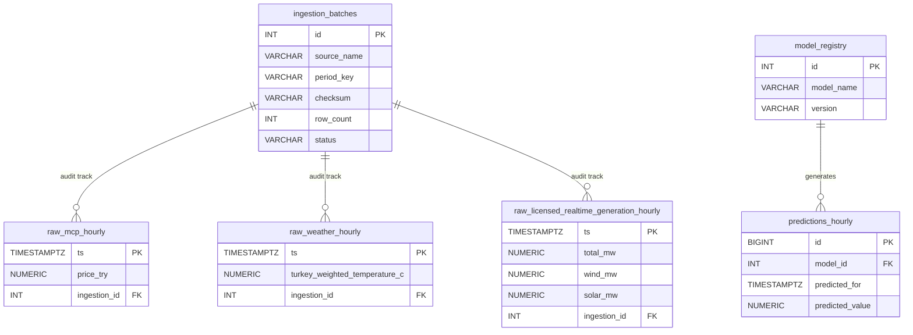

# 📐 Veri Tabanı Tasarımı & Özet Mimari Rehberi

Bu doküman, Enerji Fiyat Tahmini projesinin **Disksiz In-Memory ETL** yaklaşımı ile çalışan PostgreSQL veri mimarisini, tabloları ve katmanlı yapıyı özetler. Detaylı DDL tanımları ve kapsamlı rehber için [db_architecture_guide.md](file:///c:/Users/ASUS/Desktop/enerji_fiyat_tahmini/docs/db_architecture_guide.md) dosyasına bakabilirsiniz.

---

## 🚀 1. Mimari Yaklaşım: Disksiz In-Memory ETL

Projeyle ilgili alınan stratejik karar doğrultusunda, verilerin yerel diskte (JSON dosyası olarak) depolanması yerine, **EPİAŞ ve Open-Meteo (Hava Durumu) API** endpoints'lerinden çekilen ham JSON verileri doğrudan bellekte (**RAM**) işlenerek (ETL'den geçirilerek) PostgreSQL veritabanına aktarılır.

### Katmanlı Veri Akışı
1. **Bronze Katmanı (Audit & Ingestion Track - `ingestion_batches`):**
   * Veriler API'den çekildiği anda, yük yük (batch) olarak `ingestion_batches` tablosuna kaydedilir.
   * Çekilen JSON paketinin **SHA-256 dijital imzası (checksum)** hesaplanarak bu tabloya yazılır. Mükerrer (daha önce çekilmiş ve değişmemiş) verilerin veritabanına tekrar işlenmesi engellenir (**Idempotency / Tekrar Çalıştırılabilirlik**).

2. **Silver Katmanı (Normalized Time-Series & Snapshot Tables - `raw_*`):**
   * Bellekte parse edilen veriler, saatlik ve günlük zaman serisi tablolarına (`raw_mcp_hourly`, `raw_weather_hourly`, `raw_licensed_realtime_generation_hourly`, vb.) basılır.
   * **`ON CONFLICT (ts) DO UPDATE`** kuralı sayesinde, EPİAŞ tarafından geçmiş saatlerde yapılan veri revizyonları (örneğin kesinleşen gerçekleşen üretim veya SMF düzeltmeleri) anahtar çatışması yaratmadan doğrudan güncellenir.

3. **Gold & ML Katmanı (Feature & Training Store):**
   * Saatlik ve günlük tablolardan gecikmeli (lag) özellikler, hareketli ortalamalar (rolling means), hava durumu sıcaklık verileri ve makro göstergeler birleştirilerek model eğitim matrisi (Feature Store / ML View) oluşturulur.
   * `model_registry` ve `training_runs` ile model versiyonları ve başarı metrikleri takibe alınır.

4. **Prediction & Serving Katmanı (Tahminler ve Sunum):**
   * Üretilen gelecek saatlik PTF/SMF tahminleri `predictions_hourly` tablosunda saklanır.
   * Dashboard ve API'ler, karmaşık sorgular yerine hazır SQL Görünümleri (`v_dashboard_price_comparison`, `v_dashboard_hourly_features`) üzerinden saniyeler içinde veriyi okur.

---

## 📊 2. Güncel Veri Setleri ve Tablo Listesi (15 Endpoint)

Aşağıdaki tablo, sistemimizde işlenen 15 veri kaynağının API uç noktalarını, veritabanındaki hedef tablolarını ve periyotlarını özetlemektedir:

| # | Veri Kaynağı / Endpoint | Veritabanı Tablosu | Periyot / Tür | Açıklama |
|---|---|---|---|---|
| 1 | `load-plan` | `raw_load_forecast_hourly` | Saatlik | Yük Tahmini (LEP - MW) |
| 2 | `kgup` | `raw_kgup_hourly` | Saatlik | Kesinleşmiş Gün Öncesi Üretim Planı (Kaynak bazlı kırılım) |
| 3 | `mcp` | `raw_mcp_hourly` | Saatlik | Piyasa Takas Fiyatı (PTF - TRY, USD, EUR / MWh) - **Hedef Değişken ($y$)** |
| 4 | `smp` | `raw_smp_hourly` | Saatlik | Sistem Marjinal Fiyatı (SMF - TRY / MWh) |
| 5 | `dam-bid` / `dam-offer` | `raw_bids_offers_hourly` | Saatlik | Gün Öncesi Piyasası Eşleşen Alış ve Satış Teklif Miktarları |
| 6 | `rt-gen` | `raw_actual_generation_hourly` | Saatlik | Gerçekleşen Üretim (Doğalgaz, Barajlı, Rüzgar, Güneş, vb. - MW) |
| 7 | `rt-cons` | `raw_actual_consumption_hourly` | Saatlik | Gerçekleşen Tüketim (MW) |
| 8 | `yfinance` (USDTRY, BZ=F) | `raw_macro_daily` | Günlük | Dolar/TL Kuru ve Brent Petrol Fiyatları |
| 9 | `licensed-realtime-generation` | `raw_licensed_realtime_generation_hourly` | Saatlik | Lisanslı Gerçekleşen Üretim (Rüzgar, Güneş, Jeotermal vb. - MW) |
| 10 | `new-installed-capacity` | `raw_installed_capacity_daily` | Periyodik / Günlük | Türkiye Yenilenebilir ve Toplam Kurulu Güç Kapasitesi (MW) |
| 11 | `daily-reference-price` | `raw_natural_gas_daily` | Günlük | Doğalgaz Günlük Referans Fiyatı (GRF - TRY, USD, EUR) |
| 12 | `Open-Meteo API` | `raw_weather_hourly` | Saatlik | Türkiye Ağırlıklı Saatlik Sıcaklık ($^\circ\text{C}$) - Tüketime etki eden en kritik dış değişken |
| 13 | `active-fullness` | `raw_master_active_fullness` | Snapshot | Baraj Aktif Doluluk Oranları (%) |
| 14 | `water-energy-provision` | `raw_master_water_energy_provision` | Snapshot | Baraj Su Enerji Karşılığı ve Potansiyeli (MWh) |
| 15 | `ingestion_batches` | `ingestion_batches` | Audit / Batch | Tüm API aktarımlarının dijital imza (checksum) ve log kaydı |

---

## 🔗 3. Varlık İlişki Diyagramı (ERD - Özet)

---

## 🛠️ 4. Neden Bu Tasarımı Seçtik? (Neden Yapıyoruz / Neden Önemli?)

1. **Performans ve Depolama Kalitesi (Disksiz ETL):**
   * Yüzlerce JSON dosyasını yerel diskte saklayıp oradan tekrar veritabanına aktarmak çift katmanlı IO yükü (disk okuma/yazma) yaratır. API'den gelen verilerin doğrudan RAM'de ETL'den geçirilip DB'ye yazılması süreçleri **%70+** daha hızlı hale getirir ve diskte gereksiz dosya kalabalığı oluşturmaz.
2. **Revizyon Korunması (Idempotent Insert):**
   * EPİAŞ kesinleşmemiş üretim veya takas verilerinde ertesi gün düzeltme yapabilir. `ON CONFLICT (ts) DO UPDATE` sayesinde hem aynı veri tekrar geldiğinde hata almayız, hem de değerler revize edildiyse otomatik olarak veritabanımızdaki veri güncellenir.
3. **Hava Durumu ve Lisanslı Üretim Entegrasyonunun Önemi:**
   * Enerji talebini (Dolayısıyla PTF'yi) belirleyen en büyük dış faktör **Sıcaklık (Isıtma/Soğutma yükü)** ve grid dengesini değiştiren yenilenebilir (Rüzgar/Güneş) üretim miktarlarıdır. Yeni eklediğimiz `raw_weather_hourly` ve `raw_licensed_realtime_generation_hourly` tabloları, modelimizin tahmin başarısını (RMSE / MAE) ciddi oranda iyileştiren temel sütunları barındıracaktır.
