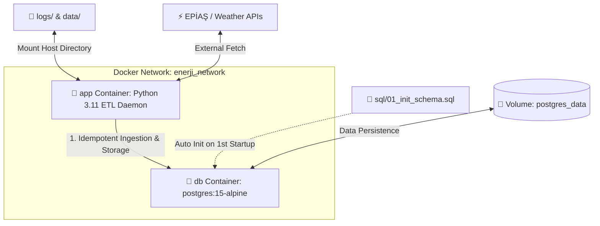

# 🐳 Docker & Container Kurulum ve Çalıştırma Rehberi

Bu doküman, **Enerji Fiyat Tahmini** projesinin tamamını (PostgreSQL Veritabanı ve Python ETL / 7/24 Arka Plan Servisi) **Docker** ve **Docker Compose** ortamında uçtan uca çalıştırma rehberidir.

---

## 🏗️ 1. Container Mimarisi

Sistem, izolasyon ve kolay canlıya alım (deployment) için iki ana konteyner servisinden oluşur:



### Servis Detayları:
1. **`db` (PostgreSQL 15-alpine)**:
   - Veritabanı altyapısını sağlar.
   - İlk çalıştırmada `sql/01_init_schema.sql` dosyasını okuyarak veritabanı şemasını, tabloları, indeksleri ve görünümleri (`VIEWS`) otomatik olarak ilklendirir.
   - `postgres_data` adında named volume kullanarak verilerin konteyner kapansa bile kalıcı olmasını sağlar.
   - Healthcheck mekanizması ile `app` servisi başlatılmadan önce veritabanının hazır olduğunu doğrular.

2. **`app` (Python 3.11-slim Daemon)**:
   - Projenin `run_service.py` dosyasını çalıştırır.
   - Zaman dilimi `Europe/Istanbul` olarak ayarlanmıştır.
   - İlk açılışta geçmiş eksik verileri tarar/doldurur ve ardından her gün saat 04:00'te otomatik veri çekme boru hattını (daily pipeline) tetikler.

---

## 🛠️ 2. Ön Gereksinimler ve Yapılandırma

### 1. Docker & Docker Compose
Bilgisayarınızda **Docker Desktop** (macOS/Windows) veya **Docker Engine + Docker Compose** (Linux) kurulu olmalıdır.

### 2. Çevre Değişkenleri (`.env`)
Proje ana dizinindeki `.env` dosyasını Docker ağ yapısına uygun olarak düzenleyin.

> [!IMPORTANT]
> Docker ortamında Python uygulamasının veritabanı konteynerine erişebilmesi için `POSTGRES_HOST=db` olmalıdır (`localhost` değil).

Örnek `.env` içeriği:
```env
# EPİAŞ Şeffaflık Platformu Giriş Bilgileri
EPIAS_USERNAME=kullanici_adiniz@mail.com
EPIAS_PASSWORD=sifreniz

# PostgreSQL Veritabanı Ayarları (Docker container servisi adı: db)
POSTGRES_HOST=db
POSTGRES_PORT=5432
POSTGRES_DB=enerji_db
POSTGRES_USER=postgres
POSTGRES_PASSWORD=postgres
```

---

## 🚀 3. Hızlı Başlangıç Komutları

### 1. Konteynerleri Derleyin ve Arka Planda Başlatın
```bash
docker compose up --build -d
```
*Bu komut Docker imajını derler, veritabanı sağlık kontrolünün tamamlanmasını bekler ve ardından Python servisini başlatır.*

### 2. Konteyner Durumlarını Kontrol Edin
```bash
docker compose ps
```

### 3. Canlı Log İzleme
Tüm servislerin veya tek bir servisin loglarını anlık olarak takip edebilirsiniz:

```bash
# Tüm servis logları
docker compose logs -f

# Yalnızca Python ETL uygulamasının logları
docker compose logs -f app

# Yalnızca PostgreSQL veritabanının logları
docker compose logs -f db
```

### 4. Konteynerleri Durdurma
Sistemi durdurmak için:
```bash
docker compose down
```
*(Veriler `postgres_data` volume'unda saklandığı için veritabanındaki verileriniz silinmez.)*

---

## 🧹 4. Veritabanını ve Sıfırdan Yüklemeyi Temizleme (Reset)

Veritabanını tamamen sıfırlamak ve `01_init_schema.sql` dosyasının baştan çalıştırılmasını sağlamak isterseniz volume ile birlikte temizleyebilirsiniz:

```bash
# Volume'ları silerek komple temizle
docker compose down -v

# Yeniden temiz kurulum başlat
docker compose up --build -d
```

---

## 🔍 5. Sık Karşılaşılan Sorunlar ve Çözümler (Troubleshooting)

| Sorun | Neden | Çözüm |
| :--- | :--- | :--- |
| `OperationalError: could not translate host name "db"` | `.env` dosyasında `POSTGRES_HOST` değeri `localhost` kalmış. | `.env` dosyasında `POSTGRES_HOST=db` yapın ve `docker compose restart app` çalıştırın. |
| `port is already allocated: 5432` | Bilgisayarınızda (local) başka bir PostgreSQL servisi çalışıyor. | Bilgisayardaki PostgreSQL servisini durdurun veya `docker-compose.yml` içinde host portunu `"5433:5432"` yapın. |
| `Permission denied` / Log yazılamıyor | Host üzerindeki `logs/` klasörünün yazma izinleri kısıtlı. | `chmod -R 777 logs data` komutuyla klasör izinlerini düzenleyin. |

---

## 📁 6. İlgili Dosya Bağlantıları

- 🐳 [Dockerfile](file:///Users/beratkaratasoglu/etkb_intern_project/enerji_fiyat_tahmini/Dockerfile)
- 🐙 [docker-compose.yml](file:///Users/beratkaratasoglu/etkb_intern_project/enerji_fiyat_tahmini/docker-compose.yml)
- ⚙️ [.env.example](file:///Users/beratkaratasoglu/etkb_intern_project/enerji_fiyat_tahmini/.env.example)
- 🚫 [.dockerignore](file:///Users/beratkaratasoglu/etkb_intern_project/enerji_fiyat_tahmini/.dockerignore)
- 🗄️ [sql/01_init_schema.sql](file:///Users/beratkaratasoglu/etkb_intern_project/enerji_fiyat_tahmini/sql/01_init_schema.sql)
