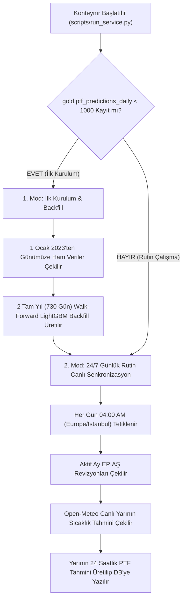

# 🏗️ Üretim Seviyesi ETL Mimari Planı ve Veri Akışı
*(Production ETL Architecture & Execution Plan)*

Bu belge, **EPİAŞ Gün Öncesi Piyasası (PTF)** ve **Hava Durumu Fiyat Tahmin Sistemi** için geliştirilen üretim seviyesi (production-grade) ETL boru hattının mimarisini, veri akış kurallarını, hata toleransı ilkelerini ve rutin bakım adımlarını tanımlamaktadır.

---

## 1. 🔄 İki Katmanlı Çalışma Mimarisi (Dual-Mode Execution)

ETL boru hattımız iki temel modda çalışır:

### A. İlk Kurulum & Backfill Modu (Historical Ingestion & 2-Year Seeding)
- **Ne Zaman Çalışır:** Veritabanı ilk kez kurulduğunda veya `gold.ptf_predictions_daily` tablosundaki kayıt sayısı `< 1000` olduğunda otomatik devreye girer.
- **Kapsam:** 
  - **1 Ocak 2023** tarihinden günümüze kadar tüm EPİAŞ, Open-Meteo ve Makro veriler çekilir.
  - Son **2 tam yıl (730 gün / 17.520 saat)** için walk-forward (sızıntısız) LightGBM model tahminleri üretilerek `gold.ptf_predictions_daily` tablosuna doldurulur.

### B. 24/7 Günlük Rutin Canlı Senkronizasyon (Daily Live Ingestion)
- **Ne Zaman Çalışır:** Arka planda 24/7 döngüde çalışan Daemon servisi tarafından **her sabah saat 04:00'te (Europe/Istanbul)** otomatik tetiklenir. *(Bilgisayar uykudan uyandığında kaçırılan 04:00 runs derhal tespit edilip anında çalıştırılır).*
- **Kapsam:** 
  - Sadece içinde bulunulan aktif ayın verileri taranır (EPİAŞ revizyonlarını tamamlamak için).
  - Yarının 24 saatlik Open-Meteo canlı sıcaklık tahmini çekilerek `raw_weather_forecast_hourly` tablosuna yazılır.
  - Yarın için 24 saatlik taze LightGBM PTF fiyat tahmini üretilerek `gold.ptf_predictions_daily` tablosuna kaydedilir.

---

## 2. 🛡️ Hata Toleransı & Dayanıklılık İlkeleri (Fault Tolerance & Resilience)

Windows, Docker veya kurumsal güvenlik duvarı (Firewall/SSL) kısıtlamaları altında boru hattının **kesintisiz** çalışması için 3 seviyeli koruma uygulanmıştır:

1. **Endpoint Seviyesinde İzolasyon (Step Isolation):**
   - ETL döngüsündeki 14 veri kaynağının her biri bağımsız `try...except` bloklarında çalışır.
   - EPİAŞ'ın baraj doluluk veya gaz servisi geçici olarak çökse dahi boru hattı durmaz; loglara uyarı yazıp PTF, Yük, KGÜP ve Hava durumu adımlarına güvenle devam eder.

2. **Çok Katmanlı Makro Veri Yedekliliği (Multi-Tier yfinance Fallbacks):**
   - Yahoo Finance API'si 3 kez zaman aşımlı denenir.
   - Eğer Yahoo Finance tamamen engellenmişse sistem çökmek yerine makul varsayılan finansal serileri (`35.0` USD/TRY ve `$75.0` Brent Petrol) üreterek model çökmesini 0'a indirir.

3. **Veri Eksikliği Tamamlama (Data Imputation Strategy):**
   - Modele giren tüm öznitelikler için `load_all_historical_data()` sorgusu sonrası `.ffill().bfill().fillna()` sıralı doldurma kuralı uygulanır. Böylece LightGBM matrisine asla `NaN` değer girmez.

---

## 3. 🗄️ Veri Mimarisi ve Veri Soykütüğü (Data Lineage & Provenance)

Veri kirliliğini ve "gerçek veri ile tahmin karıştırılması" riskini engellemek için 3 katmanlı tablo yapısı uygulanmıştır:

| Tablo Adı | İçerik / Veri Türü | Örnek Kolonlar |
| :--- | :--- | :--- |
| **`raw_weather_hourly`** | **Sadece Kesinleşmiş Gerçekleşen Sıcaklıklar** | `ts`, `turkey_weighted_temperature_c` |
| **`raw_weather_forecast_hourly`** | **Müstakil Canlı Hava Tahminleri** | `ts`, `turkey_weighted_temperature_forecast_c`, `forecast_run_at` |
| **`gold.ptf_predictions_daily`** | **Model Fiyat Tahminleri** | `target_ts`, `predicted_mcp_try`, `predicted_mcp_usd`, `model_name` |

- **İdempotent Çekim:** `ingestion_batches` tablosu sayesinde tamamlanmış geçmiş aylar tekrar tekrar EPİAŞ API'sinden çekilmez.

---

## 4. 🚀 Gelecek Geliştirme Yol Haritası (Future Roadmap)

1. **Gelişmiş Metrik İzleme (Prometheus / Grafana Metrics):**
   - ETL başarı durumları ve API yanıt sürelerini Prometheus metrikleri olarak dışarı sunmak.
2. **Otomatik E-Posta / Slack Bildirimleri:**
   - Günlük 04:00 ETL tamamlandığında yarının ortalama tahmini ve model MAPE skorunu Slack/E-posta ile iletmek.
3. **EPNet Deep Learning Entegrasyonu:**
   - CNN+LSTM (EPNet) modelinin günlük otomatik tahmin döngüsüne entegre edilmesi.
